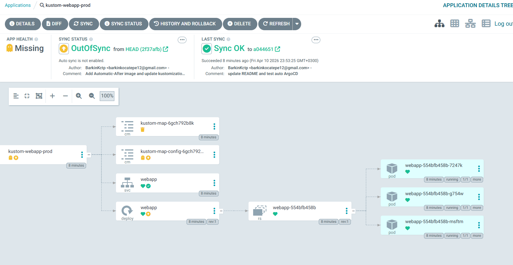
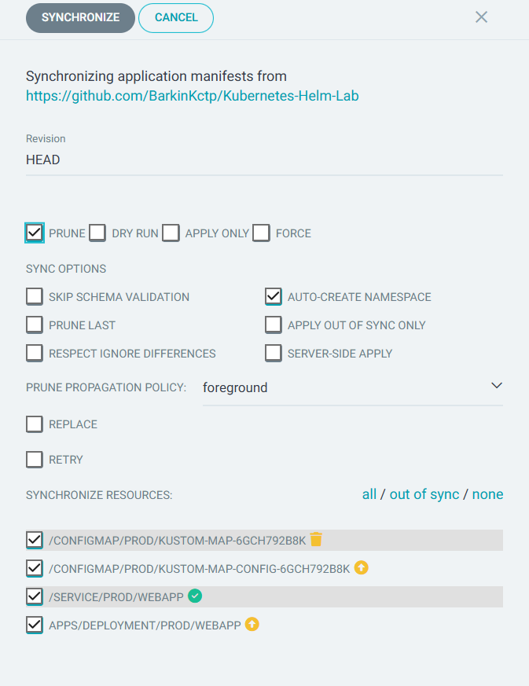
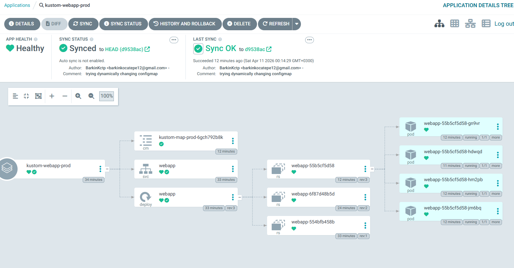

# ArgoCD Deployment Guide

Deploy k8s-lab using ArgoCD with GitOps workflow.

## Quick Start

### 1. Install ArgoCD

```bash
kubectl create namespace argocd
kubectl apply -n argocd -f https://raw.githubusercontent.com/argoproj/argo-cd/stable/manifests/install.yaml
```

### 2. Access ArgoCD

**Web UI:**

```bash
kubectl port-forward svc/argocd-server -n argocd 8080:443
# Access: https://localhost:8080
# Password: kubectl -n argocd get secret argocd-initial-admin-secret -o jsonpath="{.data.password}" | base64 -d
```

**CLI:**

```bash
brew install argocd
argocd login 127.0.0.1:8080
```

### 3. Deploy Application

**Option A - CLI:**

```bash
argocd app create kustom-webapp-prod \
  --repo https://github.com/BarkinKctp/Kubernetes-Helm-Lab \
  --path kustom-webapp/overlays/prod \
  --dest-server https://kubernetes.default.svc \
  --dest-namespace prod
```

**Option B - UI:**

- Settings > Repositories > Connect: `https://github.com/BarkinKctp/Kubernetes-Helm-Lab`
- Create app: Name `kustom-webapp-prod`, Path `kustom-webapp/overlays/prod`, Namespace `prod`
- Enable Sync

## ConfigMap Immutability Pattern

**Workflow:**

1. Change `config.properties` in repo and push
2. ArgoCD detects change (OutOfSync)
3. Click Synchronize to deploy
4. Kustomize creates new ConfigMap with content hash
5. Deployment automatically references new ConfigMap
6. Old ConfigMap pruned (deleted)

**Before Sync:**


**Detecting Change:**


**After Sync:**


## Why Immutable ConfigMaps

In-place edits: Risky, no rollback capability

Immutable approach: New ConfigMap per version, automatic rollback via Git history

## What's Deployed

Kustomize overlays with:

- Environment-specific ConfigMaps (dev/prod)
- Replica overrides (2 dev, 4 prod)
- Security: Non-root, read-only filesystem
- Availability: HPA, PDB, rolling updates
